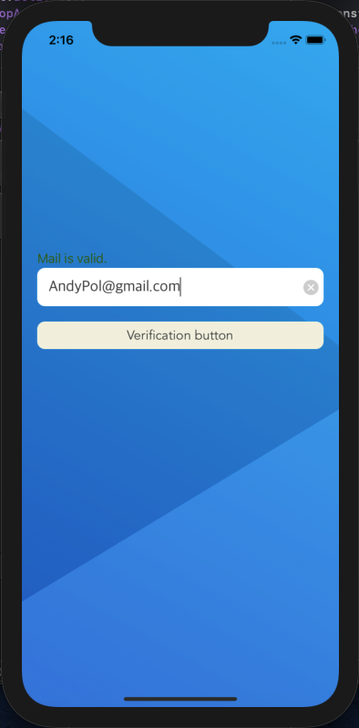

# MailChecker
___
## Оглавление
- **[Описание](#Description)**
- **[Презентация](#Presentation)**

## Описание
Учебный проект. Приложение для проверки адреса электронной почты, основной функционал:
1. проверка формата электронной почты;
2. проверка возможности доставки электронной почты, через сервис kickbox.com;
3. автозаполнение доменного имени.

- Проект написан на **UIKit**
- Архитектура **MVC**
- Верстка интерфейса **Кодом**
___

## Презентация
### Основной экран

### Работа приложения

___

